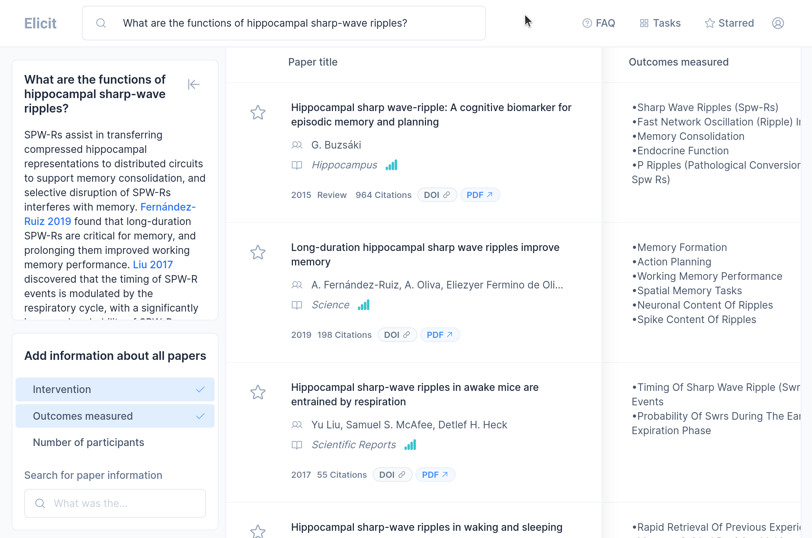

url:: https://elicit.org

- capture:: 
-
- Elicit seems originally geared towards the analysis of biomedical papers and clinical trials: its preconfigured queries (bottom-left column) pertain *interventions*, *outcomes measured*, and *number of participants*.
- The screenshot
- ). First pdf upload failed. Second attempt: good one-sentence summary, but none of the pre-specified queries were relevant. Seems like a stiff system.
-
-
-